<div align="center">


<br/>

<a href="PLAYBOOK.md"></a>
<a href="https://github.com/dantaspaulo/playbook-saida-do-google-cloud/releases/latest/download/nuvem-para-vps.zip"></a>
<a href="https://github.com/dantaspaulo"></a>


<br/><br/>

**Quando o crédito do Google acabou, a conta real do ChatADV apareceu: uns R$ 6,7 mil por mês.**<br/>
Em seis dias, as ~11 máquinas e os serviços gerenciados viraram **um servidor só, de preço fixo**,<br/>com 14 minutos fora do ar, de madrugada.<br/>
Aqui está como, com os comandos, o que deu errado e uma skill para o Claude conduzir a sua.

<br/>

<picture>
  <source media="(max-width: 700px)" srcset="docs/assets/numeros-celular.svg" />
  
</picture>

</div>

<br/>

<div align="center">

## ☁️ Antes e depois

<picture>
  <source media="(max-width: 700px)" srcset="docs/assets/antes-depois-celular.svg" />
  
</picture>

<sub>Antes: média de 19 a 23/09/2026 no export de faturamento, valor líquido. Depois: o servidor no preço de renovação, não no promocional, mais o que ficou no Google.</sub>

</div>

<br/>

<div align="center">

## 🧭 O caminho

<picture>
  <source media="(max-width: 700px)" srcset="docs/assets/metodo-celular.svg" />
  
</picture>

</div>

| Dia | O que aconteceu |
|---|---|
| antes | Cortes dentro do próprio Google: nós do Swarm e balanceador a menos, busca vetorial junto da busca em texto, discos do tamanho do uso. A conta já caiu bastante. |
| 1 | MySQL sai do banco gerenciado para contêiner. Decisão: um servidor só, de preço fixo, e zero dependência do Google para rodar a produção. Portainer no ar à noite. |
| 2 | Madrugada: busca copiada (3 min de parada), réplica do MySQL ligada, **corte geral em 14 min**. De manhã, provas com uso real. À tarde, Google **parado** (não apagado). |
| 3 a 5 | Atualização de um serviço de dados, deploy sem queda medido, poda diária de disco. |
| 6 | **Origem da aplicação fechada** para só aceitar o proxy. Tudo verde: VMs, discos, snapshots e IP fixo apagados. |

<br/>

## 🌙 A ordem do corte

Um script com passos nomeados, **um por vez, parando no primeiro erro**, com a volta escrita antes.

| # | Passo | Confere antes de seguir |
|---|---|---|
| 1 | `pre` | nenhum deploy em andamento, réplica com atraso zero, pagamento respondendo pelo IP novo, mesmas imagens por digest, foto do estado para a volta |
| 2 | `pausar` | filas e agendador parados, minutos seguidos sem job mexendo em dado |
| 3 | `parar` | aplicações e depois dados a zero, na origem |
| 4 | `promover` | posição de replicação igual; banco novo aceita escrita; o antigo para |
| 5 | `copiar` | delta final dos volumes, em segundos |
| 6 | `subir` | stacks no servidor novo, dados primeiro |
| 7 | `testar` | cada domínio pelo IP novo, **antes** do DNS |
| 8 | `dns` | troca só onde ainda estava o IP antigo |
| 9 | `soltar` | filas andando |
| 10 | `conferir` | todas as URLs públicas respondendo |

Os detalhes de cada passo, de como cada banco foi copiado e conferido, do backup e do vigia estão no
**[playbook completo](PLAYBOOK.md)**.

<br/>

<div align="center">

## 🔥 O que deu errado

<picture>
  <source media="(max-width: 700px)" srcset="docs/assets/deu-errado-celular.svg" />
  
</picture>

<sub>Sintoma, causa e correção de cada um, e mais três, na <a href="PLAYBOOK.md#11-o-que-deu-errado">seção 11 do playbook</a>.</sub>

<br/><br/>

<picture>
  <source media="(max-width: 700px)" srcset="docs/assets/principios-celular.svg" />
  
</picture>

</div>

<br/>

## 🤖 A skill: o Claude conduzindo a sua migração

A experiência virou uma skill para o Claude. Ela não sai apagando nada: **lê e mede livremente, e
pede o seu ok antes de qualquer coisa que muda estado**.

1. **Mede o custo** lendo o CSV de faturamento (por serviço e SKU).
2. **Faz o inventário só com comandos de leitura**: VMs, discos, IPs, bancos, buckets, serverless, DNS.
3. **Separa o que tem estado** e define, para cada dado, como copiar, como conferir e como voltar.
4. **Dimensiona o servidor pelo uso medido**, com a conta no preço de renovação.
5. **Monta o servidor** com segurança: Swarm, Traefik, Portainer, deploy sem queda.
6. **Ensaia, escreve o plano de corte** e põe **backup fora do servidor com restauração provada**.
7. **Instala o vigia externo** e só depois desliga a nuvem antiga, devagar.

**Claude Code** (macOS ou Linux):

```bash
curl -L -o /tmp/nuvem-para-vps.zip https://github.com/dantaspaulo/playbook-saida-do-google-cloud/releases/latest/download/nuvem-para-vps.zip
unzip -o /tmp/nuvem-para-vps.zip -d ~/.claude/skills/
```

**Claude Code** (Windows, PowerShell):

```powershell
Invoke-WebRequest -Uri https://github.com/dantaspaulo/playbook-saida-do-google-cloud/releases/latest/download/nuvem-para-vps.zip -OutFile "$env:TEMP\nuvem-para-vps.zip"
Expand-Archive -Force "$env:TEMP\nuvem-para-vps.zip" "$HOME\.claude\skills\"
```

**Claude.ai ou app:** baixe o [`.zip`](https://github.com/dantaspaulo/playbook-saida-do-google-cloud/releases/latest/download/nuvem-para-vps.zip) e envie em **Configurações → Capacidades → Skills**.

Depois, peça do seu jeito: *"minha conta do Google Cloud está em R$ 4 mil, quero ir para um servidor de preço fixo"*.

### O que vem dentro

```
nuvem-para-vps/
├── SKILL.md                      o roteiro das 10 fases
├── scripts/
│   ├── ler_custo.py              lê o CSV de faturamento e mostra o que pesa
│   └── inventario_gcp.sh         inventário do projeto, só leitura
├── references/
│   ├── estado.md                 como copiar e conferir cada tipo de dado
│   ├── dimensionamento.md        tamanho do servidor pelo uso medido
│   ├── vps-segura.md             montar a máquina, na ordem
│   ├── plano-de-corte.md         o roteiro do corte e da volta
│   └── armadilhas.md             o que já deu errado
└── assets/
    ├── traefik-stack.yml         borda com certificados e o filtro de cabeçalho
    ├── portainer-stack.yml       painel atrás do Traefik
    ├── app-exemplo-stack.yml     aplicação + banco com deploy sem queda
    ├── dreno.sh                  segura o SIGTERM para não derrubar requisição
    ├── origem-cloudflare.sh      fecha 80/443 para tudo que não for a Cloudflare
    ├── backup.sh                 dumps diários para fora do servidor
    ├── backup.teste.sh           prova de restauração em contêiner sem rede
    ├── vigia-worker.js           vigia externo em Cloudflare Worker
    └── wrangler.toml
```

Os scripts e modelos também servem sem o Claude: é só ler e adaptar.

<br/>

<div align="center">

## 👋 Quem fez

<a href="https://github.com/dantaspaulo">
<picture>
  <source media="(max-width: 700px)" srcset="https://raw.githubusercontent.com/dantaspaulo/dantaspaulo/main/assets/papeis-celular.svg" />
  
</picture>
</a>

**Paulo Sérgio Dantas** constrói negócios com IA.<br/>
<sub>Empresário, Forward Deployed Engineer e advogado. A migração foi conduzida por agentes de IA, com o meu ok em cada passo que mudava alguma coisa.<br/>Também fiz a <a href="https://github.com/dantaspaulo/skill-perfil-github">skill perfil-github</a>, que monta o seu GitHub com cara de portfólio.</sub>

<br/>

<a href="https://github.com/dantaspaulo"></a>
<a href="https://paulosdantas.adv.br"></a>
<a href="https://www.linkedin.com/in/paulosdantas/"></a>
<a href="mailto:contato@paulosdantas.adv.br"></a>

<br/><br/>

<sub>Licença MIT: use, adapte e compartilhe. Se te ajudou a cortar a conta, me conta quanto.</sub>


</div>
